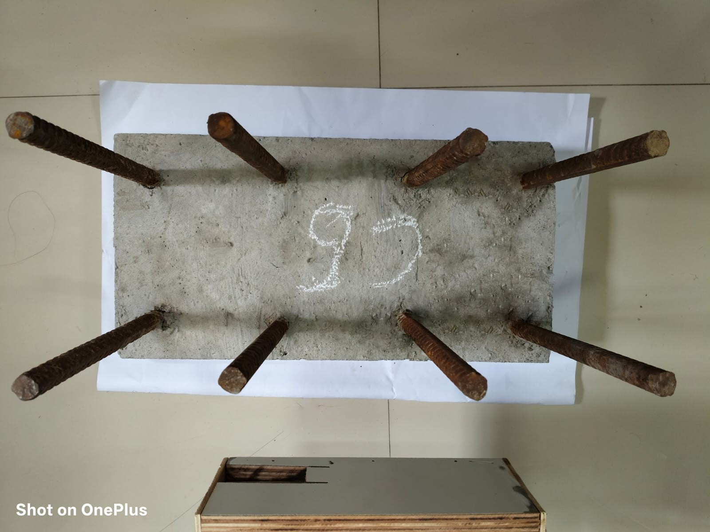
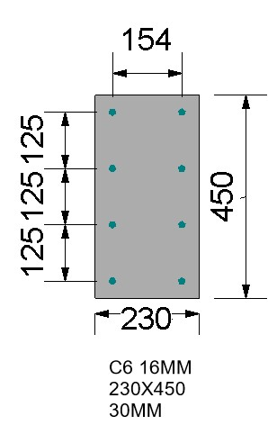
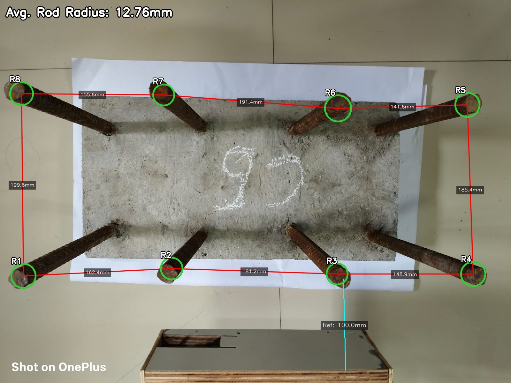
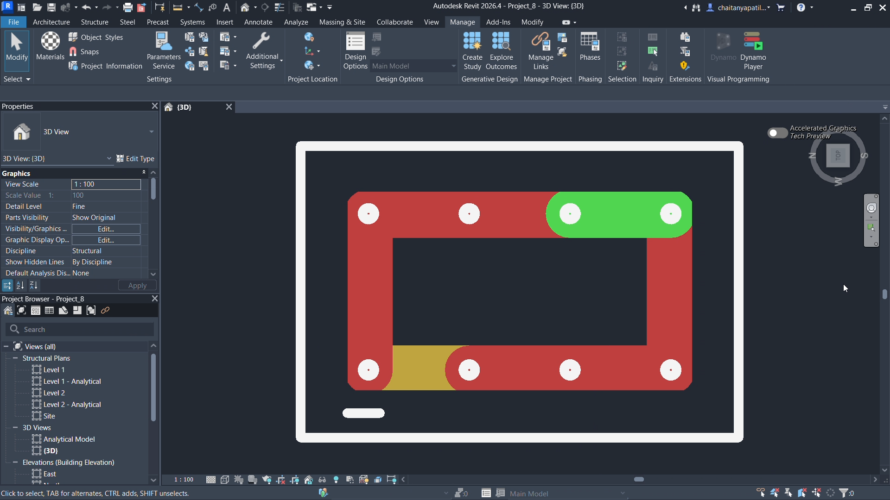
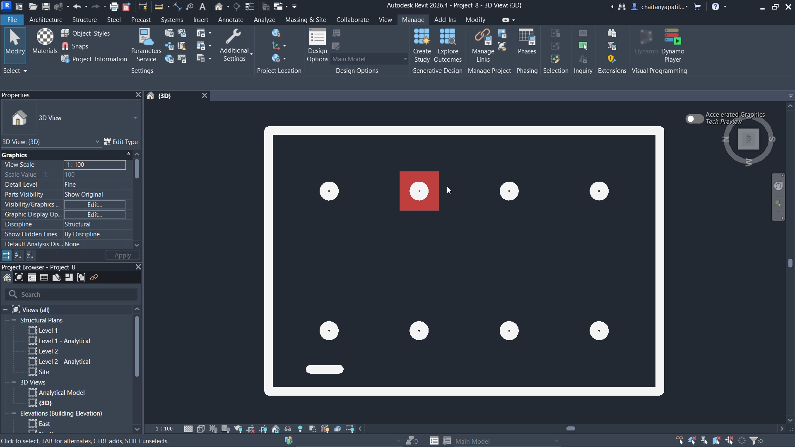

# RebarAnalysis

<div align="center">

**An AI-powered Quality Control platform for civil engineering.**

Combines Computer Vision and Google Gemini AI to verify on-site rebar construction against architectural designs, with automated defect detection, instant compliance scoring, BIM integration via Autodesk Revit, and automated authority notification.

[](https://rebaranalysis.vercel.app/)
[](https://drive.google.com/drive/folders/1zSYt1vUgkju2gBJYSO7IAf-0QmljyIgO)

</div>

---

## What It Does

A site engineer uploads a photograph of a reinforced concrete column along with the architect's design drawing. The system automatically:

1. Detects rod positions, measures spacings and radii using Computer Vision
2. Compares measurements against the design using Gemini AI
3. Generates a compliance report with a similarity score
4. If the score is below 80%, sends an automated alert email to the higher authority
5. Exports JSON files that drive Autodesk Revit via Dynamo scripts to visually highlight defective rods in the BIM model

---

## Tech Stack

| Layer | Technology |
|---|---|
| Frontend | Angular 17, TypeScript, Tailwind CSS |
| Backend | Python, Flask, Flask-CORS |
| Computer Vision | OpenCV, NumPy, SciPy |
| AI / LLM | Google Gemini 3.1 Flash Lite |
| BIM Integration | Autodesk Revit, Dynamo (Python) |
| Hosting | Vercel (Frontend), Render (Backend) |
| Notifications | Gmail SMTP (smtplib) |

---

## Core Features

- **Top View Analysis**: Detects rod count, average radius, and perimeter spacings from a top-view site photograph
- **Side View Analysis**: Detects vertical stirrup spacing from a side elevation photograph
- **Scale Calibration**: Optional pixel-to-mm calibration using a physical reference object in the photo
- **AI Design Extraction**: Gemini reads the architect's drawing and extracts design specifications automatically
- **Compliance Scoring**: Weighted similarity score (Rod Count 40%, Spacing 40%, Radius 20%)
- **BIM Integration**: Downloads JSON files that highlight defective rods and colour-code spacings in Revit
- **Authority Notification**: Automatic email alert with compliance table and annotated image when score < 80%
- **CSV Export**: Download the full compliance report as a spreadsheet

---

## Column C6 — Full Demonstration

### Input Images

| Site Photograph | Architect's Design |
|---|---|
|  |  |

### Annotated Output



### Revit BIM Outputs

After downloading the result JSON files from the website, the Dynamo scripts are run inside Autodesk Revit to visualise the results directly on the BIM model.

| Rod Lines (Colour-coded spacings) | Rod Highlight (Defective rod) |
|---|---|
|  |  |

- 🟢 **Green**: Acceptable spacing
- 🟡 **Yellow**: Minor Mismatch
- 🔴 **Red**: Not Acceptable
- 🔴 **Red Circle**: Defective or misplaced rod

### Compliance Report — C6

| Parameter | Design Spec | Site Actual | Status |
|---|---|---|---|
| Number of rods | 8 | 8 | ✅ Acceptable |
| Radius of rods (avg) | 8.0 mm | 12.76 mm | ❌ Not Acceptable |
| Distance R1 to R2 | 125.0 mm | 162.36 mm | ⚠️ Minor Mismatch |
| Distance R2 to R3 | 125.0 mm | 181.16 mm | ❌ Not Acceptable |
| Distance R3 to R4 | 125.0 mm | 148.91 mm | ❌ Not Acceptable |
| Distance R4 to R5 | 154.0 mm | 185.37 mm | ❌ Not Acceptable |
| Distance R5 to R6 | 125.0 mm | 141.59 mm | ✅ Acceptable |
| Distance R6 to R7 | 125.0 mm | 191.42 mm | ❌ Not Acceptable |
| Distance R7 to R8 | 125.0 mm | 155.55 mm | ❌ Not Acceptable |
| Distance R8 to R1 | 154.0 mm | 199.60 mm | ❌ Not Acceptable |

> The CSV report, Rod Lines JSON, and Rod Highlight JSON can all be downloaded directly from the result page on the website. These files are then used with the Dynamo scripts inside Autodesk Revit to produce the BIM visualisations shown above. The Dynamo scripts are located at `test_dataset/revit_models/dynamo_scripts/`.

---

## Authority Notification System

When the similarity score is **below 80%**, the system automatically sends an email alert to the higher authority.

### How it works

1. After analysis, the result screen shows either:
   - 🟢 **"Work is acceptable. You may proceed."**: if score ≥ 80%
   - 🔴 **"Please wait. Improvement needed."**: if score < 80%
2. If the score is below 80%, two input fields appear on screen:
   - **Column Number**: e.g. `C3`
   - **Authority's Email Address**: where the alert will be sent
3. The backend sends an automated email containing the full compliance table and the annotated site photograph

### Sample Email

```
Subject: Rebar Inspection Alert: Column C3 - Score 0%

Rebar Inspection Failed

A recent site inspection for Column C3 has yielded a similarity score of 0%.

Compliance Table

Parameter          | Design Spec | Site Actual | Status
Number of rods     | 8           | 3           | Not Acceptable
Radius (avg)       | 6.0 mm      | 25.41 mm    | Not Acceptable
Distance R1 to R2  | 125.0 mm    | 265.43 mm   | Not Acceptable
Distance R2 to R3  | 125.0 mm    | 404.40 mm   | Not Acceptable
Distance R3 to R1  | 125.0 mm    | 276.24 mm   | Not Acceptable

[Annotated site photograph attached]
```

---

## Compliance Scoring Formula

### With Reference Scale (mm measurements available)

```
Final Score = (0.40 × Rod Count Score) + (0.40 × Spacing Score) + (0.20 × Radius Score)
```

### Without Reference Scale (pixel ratio comparison)

```
Final Score = (0.50 × Rod Count Score) + (0.50 × Spacing Score)
```

### Status Thresholds (per parameter)

| Error % | Status |
|---|---|
| ≤ 5% | ✅ Acceptable |
| 5% – 15% | ⚠️ Minor Mismatch |
| > 15% | ❌ Not Acceptable |

---

## BIM Integration — Dynamo Scripts

Two Python scripts are run inside Autodesk Revit's Dynamo environment. Both scripts auto-detect whether the model has 4 or 8 rods.

### `rodhighlight.py`
Reads `highlight_rod.json` from the Downloads folder and draws a red circle over the defective rod in the active 3D view.

```json
{ "reset": false, "rod": 3 }
```

### `rodlines.py`
Reads `rod_lines.json` from the Downloads folder and draws colour-coded lines connecting adjacent rods based on their spacing compliance status.

```json
{
  "reset": false,
  "lines": [
    { "from": 1, "to": 2, "status": "Acceptable" },
    { "from": 2, "to": 3, "status": "Not Acceptable" },
    { "from": 3, "to": 4, "status": "Minor Mismatch" }
  ]
}
```

Both JSON files are generated and downloadable directly from the result page on the website.

---

## Project Structure

```
RebarAnalysis/
├── backend/
│   ├── src/
│   │   ├── app.py                  # Flask API (routes, email)
│   │   ├── analysis_service.py     # OpenCV top-view analysis
│   │   ├── side_view_service.py    # OpenCV side-view analysis
│   │   ├── gemini_service.py       # Gemini AI integration
│   │   └── scoring_utils.py        # Compliance scoring logic
│   ├── .env.example
│   └── requirements.txt
│
├── frontend/
│   └── src/app/
│       ├── app.component.ts        # Main logic
│       ├── app.component.html      # UI template
│       └── app.component.scss      # Styles
│
└── test_dataset/
    ├── lab_columns/                # C1–C8 test images and outputs
    │   └── C6/                     # Full demonstration dataset
    │       ├── C6_site.jpeg
    │       ├── C6_design.jpeg
    │       ├── C6_annotated.jpg
    │       ├── C6_revit_rodlines.png
    │       ├── C6_revit_rodhighlight.png
    │       ├── C6_output_report.csv
    │       ├── C6_output_rod_lines.json
    │       └── C6_output_highlight_rod.json
    ├── revit_models/
    │   ├── 4_rod_model.rvt
    │   ├── 8_rod_model.rvt
    │   └── dynamo_scripts/
    │       ├── rodhighlight.py
    │       └── rodlines.py
    └── use_case_examples/
        ├── top_view/
        └── side_view/
```

---

## Setup & Installation

### Backend

```bash
cd backend
python -m venv venv
venv\Scripts\activate        # Windows
pip install -r requirements.txt
```

Create a `.env` file (see `.env.example`):

```
GOOGLE_API_KEY=your_gemini_api_key_here
SENDER_EMAIL=your_gmail_address@gmail.com
SENDER_APP_PASSWORD=your_gmail_app_password
```

> To get a Gmail App Password: Google Account → Security → 2-Step Verification → App Passwords

Start the backend:

```bash
cd src
python app.py
```

### Frontend

```bash
cd frontend
npm install
ng serve
```

Open `http://localhost:4200` in your browser.

---

## Usage

1. Go to [rebaranalysis.vercel.app](https://rebaranalysis.vercel.app/) or run locally
2. Select **Top View** or **Side View** mode
3. Upload the site photograph and the architect's design drawing
4. Click on each rod center to mark it on the image
5. Optionally set a reference scale by marking two known points and entering the real distance in mm
6. Click **Run Analysis Engine**
7. View the compliance report and similarity score
8. If score < 80%, enter the column number and authority email, an alert will be sent automatically
9. Download the **Rod Lines JSON** and **Rod Highlight JSON**
10. Place both files in your `Downloads` folder
11. Open Autodesk Revit with the appropriate `.rvt` model
12. Run `rodlines.py` and `rodhighlight.py` via Dynamo to visualise results in BIM

---

## Video Demonstration

Full end-to-end demonstration available on Google Drive:
[View Demonstration →](https://drive.google.com/drive/folders/1zSYt1vUgkju2gBJYSO7IAf-0QmljyIgO)
